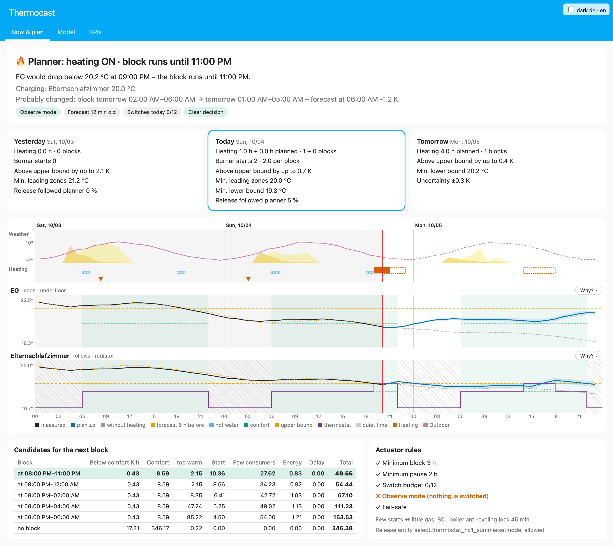
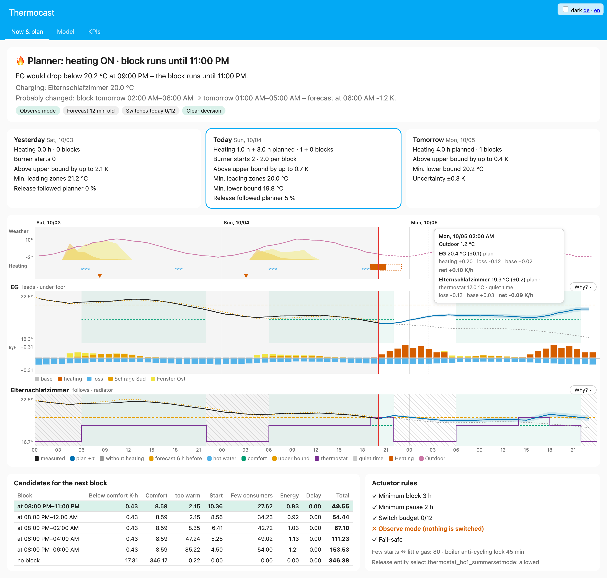
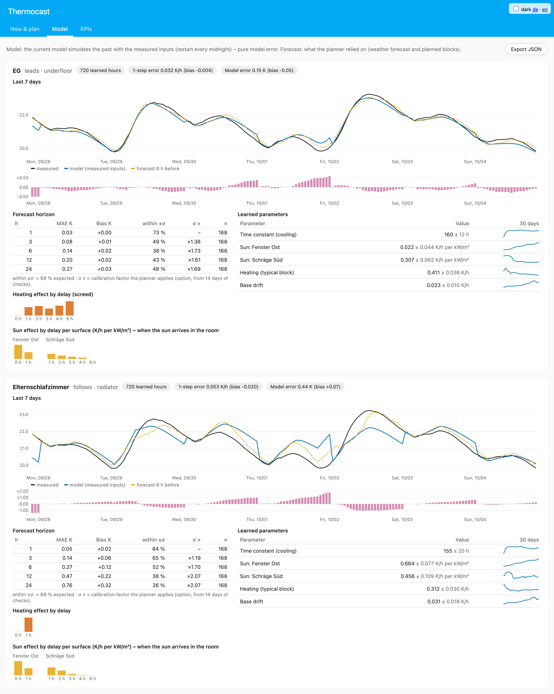
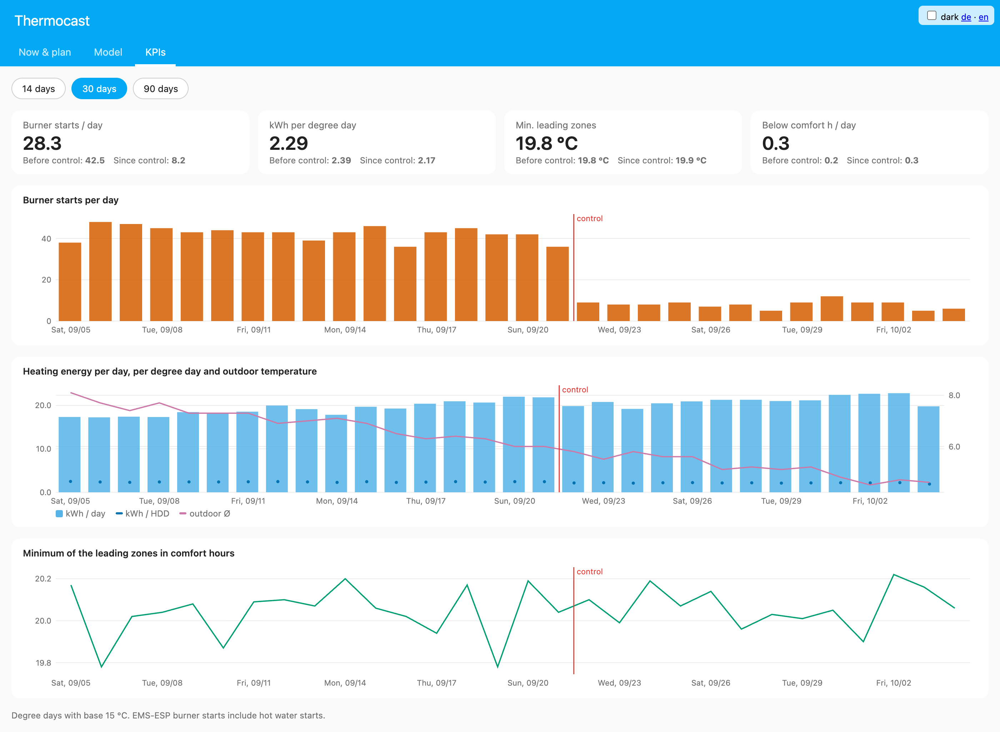
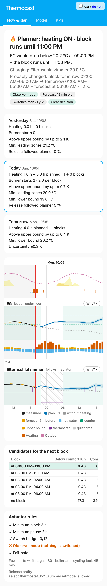

<p align="center">
  <picture>
    <source media="(prefers-color-scheme: dark)" srcset="custom_components/thermocast/brand/dark_logo@2x.png">
    
  </picture>
</p>

# Thermocast

[Deutsch](README.de.md) · **English**

Predictive heating release for Home Assistant – with **room models that learn online**,
**solar gain per window and roof surface** (Open-Meteo) and a **block planner** that lets an
oversized boiler run long and rarely instead of short and often.
Built for underfloor heating (slow screed) plus radiators; a heat pump is the next target.

> Status: v0.7 – 184 tests (synthetic test house + Home Assistant); running on a real system since October 2026
> (gas condensing boiler, Buderus RC310 via EMS-ESP, underfloor heating + radiators with Better Thermostat).
> Still young – feedback and issues welcome.
> **Starts in observe mode** and switches nothing until you turn on `Control active`.



## Why

Many modern houses have a boiler whose *minimum* output is far above what the house needs in spring and
autumn (e.g. 7 kW vs. 1–2 kW). The boiler cycles – dozens of short burner starts a day, which costs gas
and wears the burner. Weather-compensated control alone can't fix that.

Thermocast predicts per room how warm it will be **without** heating – outdoor temperature, sun on each
window and roof surface, neighbouring rooms, internal gains, the inertia of the screed – and only releases
the boiler when a leading room would otherwise drop below its comfort band. It does so in **few long blocks**
that charge the thermal mass, then lets the house coast.

## How it works

```
every 15 min:  read sensors ──► hour finished? ──► RLS update per zone (online, no retraining)
               Open-Meteo (hourly, per surface orientation) ──► 24-h simulation without heating
               planner: no block | start 0..23 h × length 2..12 h ──► cost (comfort, too warm, starts per day,
                        energy, few consumers)
               actuator: min block, min pause, daily budget, anti-cycling lock, fail-safe ──► release entity
               optional per zone: Better Thermostat target (charge in a block, lower bound, quiet time, windows)
```

**Model per zone** (hourly, linear in its parameters):

```
ΔT = b0 + a·(T_out − T) + Σ b_s,l · I_s[t−l] + Σ c_k · Q[t−k] + Σ d_n · (T_n − T) + Σ e_g · G_g
```

| Term | Meaning | Lags |
|---|---|---|
| `I_s` window | irradiance on the window surface | 0–1 h |
| `I_s` roof | irradiance on the roof surface (delayed by the insulation) | 1–6 h |
| `Q` underfloor | heating proxy (flow − room while the heating pump runs) | 0–6 h (screed) |
| `Q` radiator | proxy × valve share (thermostat `hvac_action`) | 0–1 h |
| `T_n` | neighbouring rooms | – |
| `G_g` | internal gains (power sensors, presence) | – |

**Online learning:** recursive least squares with a forgetting factor (default 0.996/h ≈ 10 days of memory),
sign projection (sun/heating/losses ≥ 0), Huber clipping against outliers, a covariance cap against
"wind-up" in summer. Hours with an open window or missing data are not learned. The planner uses
`mean − z·σ`, so an uncertain model heats earlier.

**Why not reinforcement learning?** A house yields a few hundred decisions per season; RL would need orders of
magnitude more and would have to "explore" (= be cold). Model-based control with online identification is
the data-efficient, safe option.

## Installation

**HACS (recommended):** HACS → ⋮ → *Custom repositories* → `https://github.com/drumtorben/thermocast`,
type *Integration* → download "Thermocast" → restart Home Assistant.
**Manual:** copy `custom_components/thermocast` to `config/custom_components/`, restart.
Requires Home Assistant ≥ 2026.9. Step by step (German): [`docs/INSTALLATION-CHECKLISTE.md`](docs/INSTALLATION-CHECKLISTE.md).

1. *Settings → Devices & services → Add integration → Thermocast*
2. House: outdoor temperature, flow temperature, "heating pump running" (recommended!), release entity.
3. Add zones via **"Add zone"** on the integration entry.

### Release entity – recommendation for Buderus RC310 via EMS-ESP

| Variant | Entity | "allowed" | "blocked" | If Home Assistant is down |
|---|---|---|---|---|
| **A (recommended)** | summer/winter mode (`select`), threshold fixed at 10 °C | `Winter` | `Auto` | keeps heating, or at the latest below 10 °C (damped) |
| B | summer/winter threshold (`number`) | `16` | `10` | like A, but a block only heats below 16 °C outside; the pump cycles in winter mode |
| C | summer/winter mode (`select`) | `Winter` | `Summer` | stays blocked until HA is back – only with a safeguard outside HA |

Variant A degrades gracefully and makes sure a planned block really heats on mild days. Writes are limited
(≤ 12 switches/day, ≤ 40 writes/day with confirmation and backoff), identical values are never rewritten (EEPROM).

### Charge and coast: few long burner runs

During a block, zones may warm up to their **upper bound** (default comfort + 1 K); afterwards they live off the
stored heat down to the lower bound (comfort − band during comfort time, otherwise the **base temperature**,
default comfort − 2 K). The **"Few burner starts ↔ little gas"** slider (options, default 80) weighs starts against
block hours – both per day, so a longer charge that buys a long pause pays off. Hours in which the thermostat
rooms are closed (at their limit or in quiet time) count as extra starts, so blocks land where many rooms take
heat at once. Optionally Thermocast sets each zone's **Better Thermostat** target (upper bound in a block, lower
bound otherwise), with **quiet times** (fixed and/or a `schedule` helper) without valve noise, and it respects
manual changes.

- **Open window** (window entities of the zone): the zone does not call for a block, takes no heat in the plan,
  and its thermostat holds the base temperature. Airing cools the air, not the walls: for an hour after closing
  the plan starts from the temperature before the window opened, so a short airing does not trigger a block.
  Window changes are followed live (an airing between two updates counts too); neither the airing nor the hour
  after it is learned.
- **New or reset zone model** (zone added, surfaces/sensors changed): the release stays as it was until the
  model has learned from the recorder history (a few seconds after the reload).
- **Anti-cycling lock** (option, needs a burner starts sensor): if the boiler's restart after its lock would only
  run a few minutes before the block ends, the block ends just before it – one start saved.
- **Minimum block** only limits how early a running block may end; blocks are planned from 2 h.
- **Check the heating curve:** a block only heats if the controller asks for enough flow temperature. With a
  weather-compensated curve the target flow on mild days is often barely above room temperature – then the burner
  doesn't fire at all. Fix: raise the curve's base point (e.g. ~30–35 °C at +20 °C outside). Between blocks the
  heating circuit is blocked anyway, so the higher base point practically only acts during a block.

### Example zones (surfaces as YAML in the "sunlit surfaces" field)

Bedroom – east window, south roof slope:
```yaml
- {kind: window, azimuth: 90, tilt: 90, name: East window}
- {kind: roof, azimuth: 180, tilt: 40, name: South roof}
```
Azimuth: 0 = N, 90 = E, 180 = S, 270 = W. Tilt: 90 = vertical. No size needed – the model learns the
effective area × g-value × shading.

Ground floor with underfloor heating and no actuators: **one zone** (`fbh`) with the living room + kitchen sensors,
`Leads the release` = on.

## Panel "Thermocast"

A sidebar panel answers: **why is Thermocast heating (or not) right now – and what will it do until tomorrow night?**

- **Story:** planner wish vs. release, next block, the reason in one sentence, robustness ("tight", "only because
  of the safety margin σ"), plan change since the last hour, and a note when an actuator rule overrides the planner.
- **Yesterday · today · tomorrow:** heating hours, blocks, burner starts per block, minimum of the leading zones.
- **Timeline** (yesterday 00:00 → tomorrow 24:00): weather (sun per surface), past and planned blocks, events,
  per zone measured / plan ± σ / without heating / comfort window / thermostat target / quiet time.
  **"Why?"** splits every hour exactly into sun per surface, heating, losses, neighbours, gains (the model is linear).
- **Candidates** for the next block with their cost breakdown – hover draws the trajectory into the timeline.



Tab **"Model"** (per zone): hindcast of the last 7 days with the measured inputs (pure model error), forecast
quality per horizon with σ calibration, learned parameters read physically (time constant, sun per surface,
heating, neighbours) with a 30-day history, screed lag profile, and a **JSON export** of all model states and logs.



Tab **"KPIs"** (14/30/90 days, from the recorder's long-term statistics): burner starts/day, kWh per heating
degree day, comfort – **before** and **since** control was enabled.

<p>
  
  
</p>

The plan until tomorrow comes from a **rollout of the real controller**: re-plan every hour, apply the actuator
rules, carry the state forward. The panel is view-only and runs apart from the control path – an error there never
changes the release. Panel texts: English and German.

## Safety

* Observe mode is the default.
* Turning heating on is always allowed; turning it off only after the minimum block and within the daily budget.
* Update error, forecast older than 2 h, missing sensor of a leading zone → release **on**.
  A fail-safe lasting more than 1 h raises a repair issue.
* Unloading/removing the integration or switching control off → release **on** (a reload after a config change
  doesn't). After an HA start, missing sensors/forecast wait up to 5 min before the fail-safe (MQTT/Zigbee are often late).
* **EEPROM protection:** every write must be confirmed by the entity; unconfirmed → retry after 10 min with growing
  pauses (30 min … 6 h); never more than **40 writes per day**.

## Learning, calibration, diagnostics

* **Warm start:** new zones learn from the last **30 days** of recorder statistics (+ past irradiance from Open-Meteo).
  The button *"Re-learn models from history"* does that for all zones.
* **σ calibration** (option, on by default): forecast errors of the last 14 days widen the planner's uncertainty per
  horizon (never narrow it).
* **Comfort schedule:** per zone optionally a `schedule.*` helper, e.g. office on weekdays 8–17.
* **Download diagnostics** (⋮ on the integration): all models, logs, events, actuator state.

## Development

```bash
uv sync                        # .venv with Home Assistant + pytest-homeassistant-custom-component
uv run pytest                  # core and HA tests
./scripts/develop              # local HA with fake sensors → http://localhost:8123
uv run python scripts/sample_view.py      # demo data for the panel (synthetic house)
uv run python -m http.server -d custom_components/thermocast/frontend 8765
# → http://localhost:8765/dev/   (?tab=now|model|kpis, ?lang=en, ?dark=1, ?why=1)
```

`core/` is plain Python + numpy without Home Assistant imports (notebook-friendly):
`sys.path.insert(0, "custom_components/thermocast")`, then `from core import OnlineZoneModel`.
Project notes for contributors (German): [`CLAUDE.md`](CLAUDE.md).

## Roadmap

- [x] Panel: now & plan, model quality, KPIs
- [x] Warm start from recorder history, comfort and quiet times from `schedule` helpers, diagnostics, repairs
- [x] Charge and coast: upper/lower bound, coast time, Better Thermostat control, quiet times
- [x] Blocks preferably with many open consumers; window-aware; block end matched to the anti-cycling lock
- [ ] Internal gains forecast by daily profile (then house power as a gain signal)
- [ ] Presence (`zone.home`) in comfort
- [ ] Two-state model (air + thermal mass) or a smoothed solar signal
- [ ] Raise the curve during a block (charge the screed on purpose)
- [ ] Heat pump cost function: COP(T_out, flow), EPEX price, PV surplus

## License

MIT
